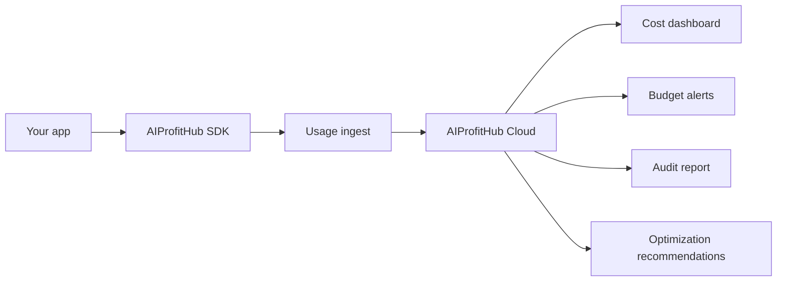

# AIProfitHub JavaScript SDK

Track AI model usage, token volume, customer attribution, feature attribution, and cost signals from JavaScript or TypeScript apps.

<p align="center">
  <strong>AI cost visibility for apps using OpenAI, Anthropic, Google, Mistral, Groq, LangChain, and custom LLM flows.</strong>
</p>

<p align="center">
  <a href="https://aiprofithub.ai/get-audit"><strong>Get an AI Spend Audit</strong></a>
  ·
  <a href="https://app.aiprofithub.ai/onboarding"><strong>Create an account</strong></a>
  ·
  <a href="https://docs.aiprofithub.ai"><strong>Read the docs</strong></a>
</p>

## Visual flow



## What this SDK does

AIProfitHub helps teams see where AI spend is going before the bill becomes a surprise.

Use this SDK to send usage events from your app into AIProfitHub Cloud:

- model used
- input and output token counts
- user, customer, and feature attribution
- provider and cost metadata
- usage data for dashboards, alerts, audits, and optimization

## Install

```bash
npm install aiprofithub-sdk
```

## Quick start

Import `createClient` from `aiprofithub-sdk`, then send usage events with provider, model, token counts, user, customer, and feature metadata.

Required fields:

- provider
- model
- inputTokens
- outputTokens

Example event:

- provider: openai
- model: gpt-4o-mini
- inputTokens: 1200
- outputTokens: 300
- userId: user_123
- customerId: customer_456
- feature: support-chat
- costUsd: 0.0042

## Start here

| Goal | Start with |
| --- | --- |
| Send one SDK event | `examples/basic-usage.ts` |
| Test API ingest without SDK install | `examples/rest-cookbook.md` |
| Copy tracking into an app route | `examples/framework-integrations.md` |
| Wrap existing OpenAI calls | `examples/openai-wrapper.md` |
| Wrap Anthropic Claude calls | `examples/anthropic-wrapper.md` |
| Track LangChain workflows | `examples/langchain-wrapper.md` |

## Free assets by use case

### 1. Integrate usage tracking

| Asset | Use it when |
| --- | --- |
| `examples/basic-usage.ts` | You want the smallest working SDK example. |
| `examples/rest-cookbook.md` | You want REST and cURL examples for non-JavaScript teams. |
| `examples/framework-integrations.md` | You want a Next.js and Express route integration guide. |
| `examples/nextjs-route-handler.ts` | You use Next.js App Router route handlers. |
| `examples/express-route.ts` | You use Express or an Express-style Node API. |
| `examples/openai-wrapper.ts` | You already use OpenAI chat completions. |
| `examples/openai-wrapper.md` | You want the guide for wrapping OpenAI calls. |
| `examples/anthropic-wrapper.ts` | You already use Anthropic Claude messages. |
| `examples/anthropic-wrapper.md` | You want the guide for wrapping Claude calls. |
| `examples/langchain-wrapper.ts` | You use LangChain-style chains or runnables. |
| `examples/langchain-wrapper.md` | You want the guide for tracking LangChain workflows. |

### 2. Estimate AI spend and margin risk

| Asset | Use it when |
| --- | --- |
| `examples/cost-calculator.html` | You want a browser-based AI spend and margin risk calculator. |
| `examples/cost-calculator.md` | You want the decision guide for using the calculator. |
| `examples/customer-margin-risk-template.md` | You want to compare AI cost per customer against customer revenue. |

### 3. Control budgets, alerts, and routing

| Asset | Use it when |
| --- | --- |
| `examples/provider-router-decision-guide.md` | You want to choose provider/model routes by cost, risk, and margin. |
| `examples/budget-alert-policy-template.md` | You want budget thresholds, anomaly alerts, and route guardrails. |
| `examples/github-action-ai-cost-check.md` | You want a CI reminder when pull requests add AI cost risk. |

### 4. Evaluate AIProfitHub before buying

| Asset | Use it when |
| --- | --- |
| `examples/sample-ai-spend-audit-report.md` | You want to see what a paid AI Spend Audit can return. |
| `examples/agent-playbooks.md` | You want sample outputs from the 9 AIProfitHub product agents. |
| `examples/README.md` | You want the full decision path from free tracking to paid Cloud. |

## Required fields

| Field | Required | Why it matters |
| --- | --- | --- |
| provider | Yes | Groups spend by AI provider. |
| model | Yes | Shows which models create cost. |
| inputTokens | Yes | Measures prompt volume. |
| outputTokens | Yes | Measures generated output volume. |
| userId | No | Attributes usage to an app user. |
| customerId | No | Attributes usage to a paying customer. |
| feature | No | Shows which product feature drives spend. |
| costUsd | No | Lets you pass known cost estimates. |
| metadata | No | Adds extra trace context for audits. |

## Decision guide

| You need to... | Use this SDK? | Next action |
| --- | --- | --- |
| Track AI calls from a JavaScript app | Yes | Install the SDK and send track events. |
| Wrap OpenAI chat completions | Yes | Use `examples/openai-wrapper.md`. |
| Wrap Anthropic Claude messages | Yes | Use `examples/anthropic-wrapper.md`. |
| Track LangChain workflows | Yes | Use `examples/langchain-wrapper.md`. |
| Choose model/provider routes | Yes | Use `examples/provider-router-decision-guide.md`. |
| Define AI budget alert policy | Yes | Use `examples/budget-alert-policy-template.md`. |
| Check customer margin risk | Yes | Use `examples/customer-margin-risk-template.md`. |
| Copy tracking into a Next.js or Express route | Yes | Use `examples/framework-integrations.md`. |
| Test API ingest without the SDK | Yes | Use `examples/rest-cookbook.md`. |
| Add a PR reminder for AI cost risk | Yes | Use `examples/github-action-ai-cost-check.md`. |
| Estimate monthly AI spend before connecting data | Yes | Open `examples/cost-calculator.html`. |
| See what an audit report looks like before buying | Yes | Read `examples/sample-ai-spend-audit-report.md`. |
| See sample agent outputs before buying | Yes | Read `examples/agent-playbooks.md`. |
| Find which customer or feature burns the most AI budget | Yes | Send customerId and feature with each event. |
| Get a one-time cost leak report | Yes | Start with an AI Spend Audit. |
| Replace your generic log stack | No | Use AIProfitHub for AI cost intelligence, not generic logs. |
| Open source your private SaaS backend | No | Keep backend, billing, and dashboard code private. |

## When users should buy AIProfitHub Cloud

The SDK is free. The paid value is the control plane around the data.

Buy AIProfitHub when you need to:

- stop surprise AI bills
- attribute AI cost by customer or feature
- detect abnormal model usage
- prepare finance-ready AI spend reports
- reduce AI cost without guessing
- protect product margin as usage grows

## Safety notes

Do not commit credentials, environment files, backend source, billing logic, or private dashboard code into public repositories.

## Commercial path

- Get an AI Spend Audit: https://aiprofithub.ai/get-audit
- Create an account: https://app.aiprofithub.ai/onboarding
- Read docs: https://docs.aiprofithub.ai

## License

MIT

